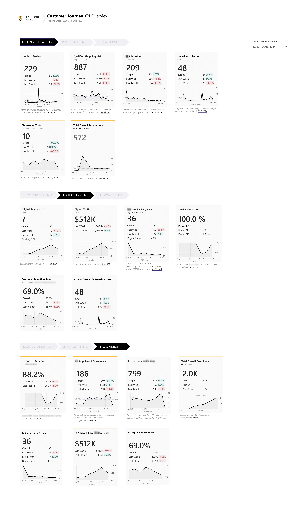
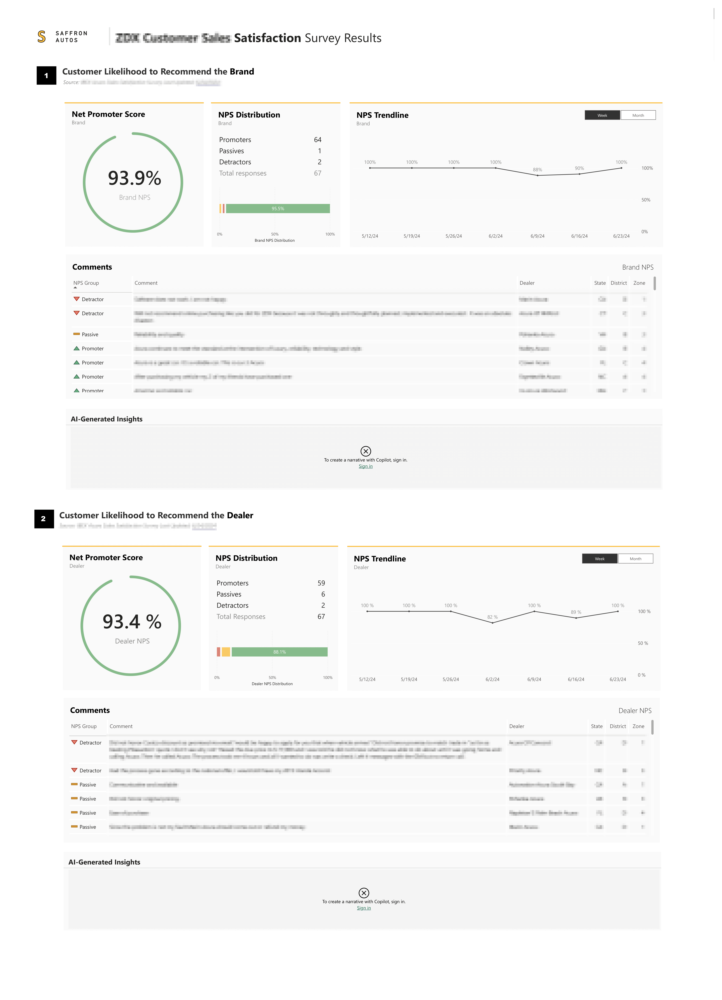
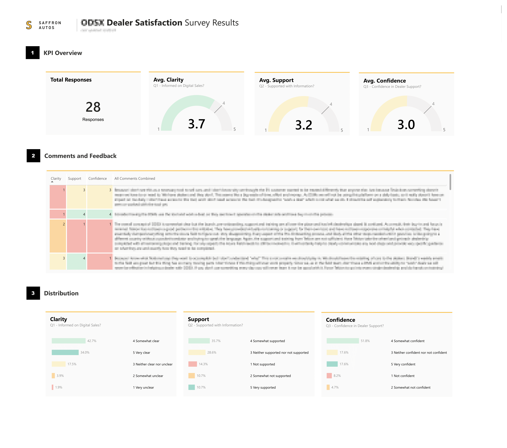

<!-- PROJECT LOGO -->
 

  

<h3 align="center">Next-Gen Digital Sales Analysis Dashboard</h3>

  

  The Power BI Digital Sales Insights Dashboard showcases dynamic sales performance insights, transforming raw data into actionable strategies.

  

<!-- TABLE OF CONTENTS -->

  
Table of Contents

  <ol>
    <li><a href="#about-the-project">About The Project</a></li>
    <li><a href="#built-with">Built With</a></li>
    </li>
    <li><a href="#usage">Usage</a></li>
    <li><a href="#screenshots">Screenshots</a></li>
    <li><a href="#contact">Contact</a></li>
  </ol>

<!-- ABOUT THE PROJECT -->
## About The Project

<!-- [![Product Name Screen Shot][product-screenshot]](https://example.com) -->

The Power BI Digital Sales Insights Dashboard is a comprehensive tool designed to provide in-depth analysis and visualization of digital sales performance. This project leverages the powerful capabilities of Power BI to turn raw data into actionable insights, helping organizations optimize their sales strategies and make data-driven decisions.

(<a href="#top">back to top</a>)

### Built With
###### Data Sources and Tools
* **Power BI**: The primary tool for data visualization and dashboard creation, offering robust features and capabilities for interactive and real-time data analysis.
* **Adobe Analytics**: Used for real-time analytics and detailed segmentation across various marketing channels.
* **Oracle SQL**: Used for querying and managing data in Oracle databases, ensuring efficient data retrieval and manipulation.
* **BigQuery**: Employed for handling and analyzing large datasets, leveraging its powerful data warehousing capabilities.
* **AWS S3**: Utilized for storing and accessing large volumes of data securely and efficiently.
* **Dataflows**: Implemented for ETL processes, allowing for the transformation and preparation of data before it reaches Power BI.
* **Amplitude**: Integrated for tracking user behaviors and analyzing product metrics.
* **Qualtrics**: Used for collecting and analyzing customer feedback and survey data.
* **Treasure Data**: Leveraged for managing and analyzing customer data, providing insights into customer behavior and engagement.
* **Excel**: Applied for data preparation, initial analysis, and integration with Power BI.
* **SharePoint**: Used for sharing and managing content, knowledge, and applications to empower teamwork.

<!-- 
* [React.js](https://reactjs.org/)
* [Vue.js](https://vuejs.org/)
* [Angular](https://angular.io/)
* [Svelte](https://svelte.dev/)
* [Laravel](https://laravel.com)
* [Bootstrap](https://getbootstrap.com)
* [JQuery](https://jquery.com) -->

(<a href="#top">back to top</a>)

<!-- SCREENSHOTS -->
## Screenshots

This dashboard provides comprehensive insights into digital sales performance. Here are some use cases and examples of how you can utilize the dashboard:

##### Sales Performance Analysis:

- Track and visualize sales metrics such as revenue, volume, and growth trends.
- Filter data by product, region, and sales channel to gain detailed insights.

##### Customer Behavior Insights:

- Analyze customer behavior using integrated data from Amplitude and Qualtrics.
- Identify key customer segments and their engagement levels.

##### Data-Driven Decision Making:

- Utilize predictive analytics to forecast sales trends.
- Customize and drill down into specific data points for deeper analysis.

(<a href="#top">back to top</a>)

<!-- Image Stack with GitHub Links -->

<!-- Image with GitHub Link -->
<b>Customer Journey KPI Overview</b> (1/8) 

  

(<a href="#top">back to top</a>)

<b>Digital Sales Dashboard</b>  (2/8) 

<!-- Image with GitHub Link -->

  

(<a href="#top">back to top</a>)

<b>Customer Satisfaction Survey Results</b>  (3/8) 

<!-- Image with GitHub Link -->

  

(<a href="#top">back to top</a>)

<b>Dealer Feedback Survey Results</b>  (4/8) 

<!-- Image with GitHub Link -->

  

 

(<a href="#top">back to top</a>)

<!-- Image with GitHub Link -->
<b>App Analytics Overview</b>  (5/8) 

  

(<a href="#top">back to top</a>)

<!-- Image with GitHub Link -->
<b>Analytics for EV Vehicles Webpages</b>  (6/8)

  

(<a href="#top">back to top</a>)

<!-- Image with GitHub Link -->
<b>Analytics for EV Services Webpages</b>  (7/8) 

  

(<a href="#top">back to top</a>)

<!-- Image with GitHub Link -->
<b>Analytics for EV Incentives Webpages</b>  (8/8)

  

 <!-- End of Center Alignment -->

(<a href="#top">back to top</a>)

<!-- CONTACT -->
## Contact

Portfolio Link: [https://shainalolin.com](https://shainalolin.com)

(<a href="#top">back to top</a>)

<!-- MARKDOWN LINKS & IMAGES -->
<!-- https://www.markdownguide.org/basic-syntax/#reference-style-links -->
[contributors-shield]: https://img.shields.io/github/contributors/github_username/repo_name.svg?style=for-the-badge
[contributors-url]: https://github.com/github_username/repo_name/graphs/contributors
[forks-shield]: https://img.shields.io/github/forks/github_username/repo_name.svg?style=for-the-badge
[forks-url]: https://github.com/github_username/repo_name/network/members
[stars-shield]: https://img.shields.io/github/stars/github_username/repo_name.svg?style=for-the-badge
[stars-url]: https://github.com/github_username/repo_name/stargazers
[issues-shield]: https://img.shields.io/github/issues/github_username/repo_name.svg?style=for-the-badge
[issues-url]: https://github.com/github_username/repo_name/issues
[license-shield]: https://img.shields.io/github/license/github_username/repo_name.svg?style=for-the-badge
[license-url]: https://github.com/github_username/repo_name/blob/master/LICENSE.txt
[linkedin-shield]: https://img.shields.io/badge/-LinkedIn-black.svg?style=for-the-badge&logo=linkedin&colorB=555
[linkedin-url]: https://linkedin.com/in/linkedin_username
[product-screenshot]: images/screenshot.png
[s1-screenshot]: images/Saffron-Autos-01.png
